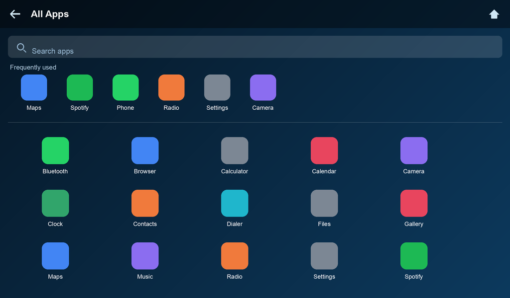
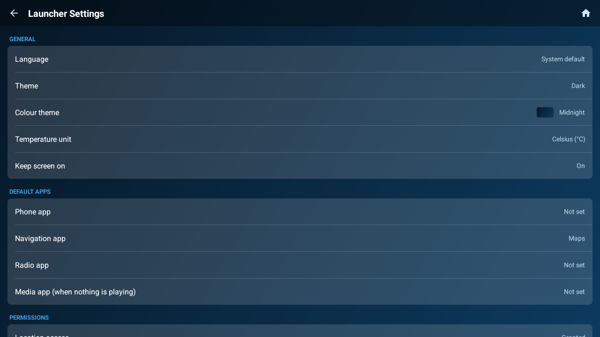
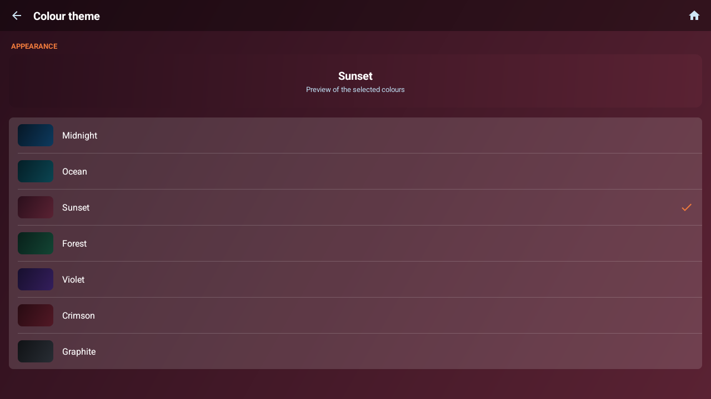

# minimal-headunit-launcher

[](https://github.com/metehankaygsz/minimal-headunit-launcher/actions/workflows/build.yml)
[](LICENSE)
[](https://developer.android.com/about/versions/android-4.4)

A clean, minimal Android home-screen launcher for car head units — the cheap
aftermarket "Android radio" double-DIN units, not Android Auto.

Kotlin, classic Views, landscape-first, **no Google Play Services required**, and
it runs all the way back to **Android 4.4 (KitKat)** so it works on old units too.

---

## Screenshots

### Dashboard

Clock, date, current conditions and a three-day forecast on the left; media and
phone on the right; quick-launch favourites along the top.


### App drawer

Search, a frequently-used strip, and the full app grid.



| Settings | Colour themes |
|---|---|
|  |  |

---

## Features

**Dashboard**

- Large clock and date, current weather, and a 3-day forecast
- Live media widget: album art, title/artist, play-pause, next/previous, and a
  scrubbable seek bar with elapsed/total times
- Quick-launch dock of 5 favourite apps in the top bar
- Wi-Fi indicator (only shown when connected)
- Six tabs: **Audio · Radio · Phone · Nav · Apps · Settings**

**App drawer**

- Live search
- "Frequently used" strip based on your own launch history
- Long-press any app to hide it from the drawer
- Refreshes automatically when apps are installed or removed

**Appearance**

- **7 colour schemes** — Midnight, Ocean, Sunset, Forest, Violet, Crimson,
  Graphite — each applying a gradient and matching accent across the whole UI
- Light and dark palettes; dark by default, with Auto (by time of day), Light,
  and Follow-system options
- Runs fullscreen with the system bars hidden, using its own in-app Back/Home
  navigation on every screen

**Setup and settings**

- Guided first-run setup: language, default apps, permissions, and a prompt to
  become the default launcher
- Everything re-configurable later in Settings
- **10 languages**: English, Turkish, Spanish, German, French, Italian,
  Portuguese, Russian, Simplified Chinese, Arabic (with RTL support)

---

## Requirements

| | |
|---|---|
| Min Android | 4.4 KitKat (API 19) |
| Target Android | 14 (API 34) |
| Orientation | Landscape |
| Google Play Services | Not required |
| API keys | None |

Designed for common head-unit resolutions — 1024×600 and 800×480 both work.

---

## Install

Grab the APK from the [latest release](../../releases/latest) and sideload it:

```bash
adb install -r minimal-headunit-launcher-v0.1.0.apk
```

Or copy the APK to a USB stick, plug it into the head unit, and open it with the
unit's file manager.

## Build from source

Open the project in **Android Studio** (Giraffe or newer). It will fetch the
right Gradle and SDK versions and generate the Gradle wrapper on first sync.

Then, from the command line:

```bash
./gradlew assembleDebug
```

```bash
./gradlew installDebug
```

### Building a release

Release builds are minified with R8 and must be signed. Create a key once —
choose your own passwords when prompted:

```bash
keytool -genkey -v -keystore release.jks -alias release -keyalg RSA -keysize 2048 -validity 10000
```

Copy `keystore.properties.example` to `keystore.properties` and fill in your
values, then:

```bash
./gradlew assembleRelease
```

`keystore.properties` and `*.jks` are gitignored — **never commit them**. Losing
the key means you can't publish updates that upgrade an existing install, so back
it up somewhere safe.

### Publishing a release

Tagging a version builds and publishes a signed APK automatically:

```bash
git tag v0.1.0 && git push origin v0.1.0
```

This needs four repository secrets under **Settings → Secrets and variables →
Actions**: `KEYSTORE_BASE64` (`base64 -i release.jks`), `KEYSTORE_PASSWORD`,
`KEY_ALIAS` and `KEY_PASSWORD`.

### Setting it as the launcher

After installing, press the unit's Home button and choose this launcher, then
select "Always". To reset the default while developing:

```bash
adb shell cmd package set-home-activity com.radiolauncher/.HomeActivity
```

---

## Permissions

All optional — the launcher degrades gracefully without them.

| Permission | Used for | Without it |
|---|---|---|
| Location | Local weather | Weather panel hides, clock still works |
| Notification access | Reading now-playing media | Media widget becomes a launch button |
| Query all packages | Listing installed apps | Required for the app drawer |

Notification access can't be granted by a normal permission dialog — Android
requires the user to enable it in system settings. Setup links straight there,
and you can revisit it at **Settings → Media info access**.

---

## Weather

Weather comes from [Open-Meteo](https://open-meteo.com), which is free and needs
**no API key or account**. Location is read through the platform
`LocationManager`, so no Play Services dependency. It refreshes every 15 minutes,
and you can switch between °C and °F in Settings.

---

## Project layout

```
app/src/main/
├── AndroidManifest.xml              # HOME intent-filter, notification listener
├── java/com/radiolauncher/
│   ├── App.kt                       # applies saved language + theme at startup
│   ├── BaseActivity.kt              # locale, fullscreen, gradient, in-app nav
│   ├── HomeActivity.kt              # the dashboard
│   ├── AppDrawerActivity.kt         # app grid: search, frequent, hide
│   ├── AppPickerActivity.kt         # "choose an app for this role"
│   ├── SetupActivity.kt             # first-run onboarding
│   ├── SettingsActivity.kt          # settings
│   ├── GradientPickerActivity.kt    # colour scheme picker
│   ├── GradientThemes.kt            # the 7 colour schemes
│   ├── ThemeManager.kt              # light / dark / auto
│   ├── LocaleManager.kt             # in-app language override
│   ├── MediaMonitor.kt              # reads the active MediaSession
│   ├── WeatherRepository.kt         # Open-Meteo client
│   ├── AppRepository.kt             # query + launch installed apps
│   ├── Prefs.kt                     # all persisted settings
│   ├── Permissions.kt               # runtime permission helpers
│   └── Usage.kt                     # launch-count tracking
└── res/
    ├── values/                      # strings, light palette, styles
    ├── values-night/                # dark palette
    ├── values-v21/                  # API 21+ theme attributes
    └── values-{ar,de,es,fr,it,pt,ru,tr,zh}/   # translations
```

---

## Compatibility notes

Supporting old head units shapes a few decisions worth knowing before you change
things:

- **Dependencies are pinned** to the last KitKat-compatible releases
  (appcompat 1.4.2, core-ktx 1.9.0, recyclerview 1.2.1). Bumping to appcompat
  1.6+ or core-ktx 1.10+ raises `minSdk` to 21 and breaks the build.
- **Launcher icons ship as PNG mipmaps**, because vector and adaptive icons don't
  render as app icons before Android 5.0. Adaptive icons in `mipmap-anydpi-v26`
  are used only on API 26+.
- **API 21+ theme attributes** live in `values-v21/` so they don't affect KitKat.
- **Fullscreen** uses the legacy `systemUiVisibility` flags rather than
  `WindowInsetsController`, which doesn't exist below API 30.
- **The language override** wraps each activity's context instead of using
  `AppCompatDelegate.setApplicationLocales`, which needs appcompat 1.6+.
- **The media widget requires Android 5.0+** (`MediaSessionManager`). On KitKat it
  falls back to acting as a launch button.

---

## Contributing

Screenshots in this README are captured from a real unit. To refresh them after a
UI change, connect the head unit (or an emulator) with USB debugging on and run:

```bash
./tools/capture-screenshots.sh
```

Read the **Compatibility notes** above before upgrading any dependency — several
are pinned deliberately to keep Android 4.4 support.

---

## Roadmap

- Reorderable favourites dock (drag and drop)
- Hourly forecast in the weather panel
- Signed release builds with R8 shrinking
- Optional analog clock face

---

## License

MIT — see [LICENSE](LICENSE).
