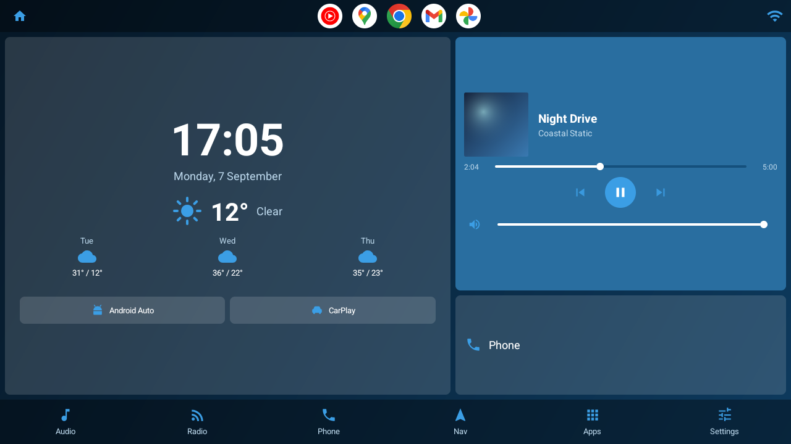
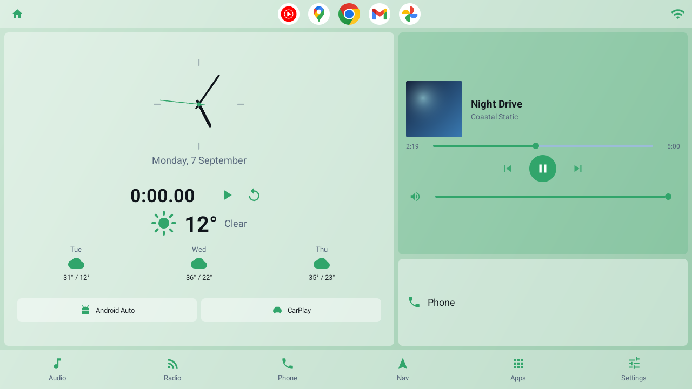
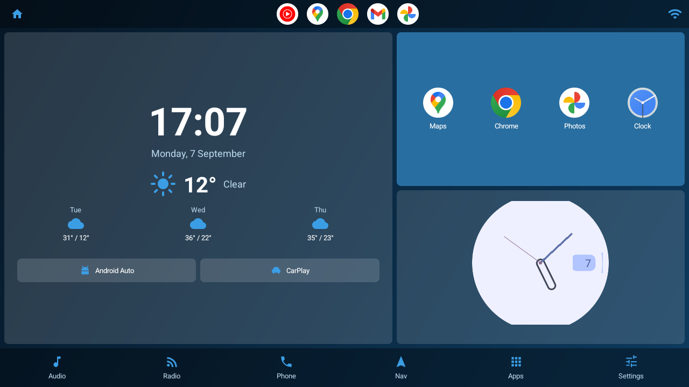
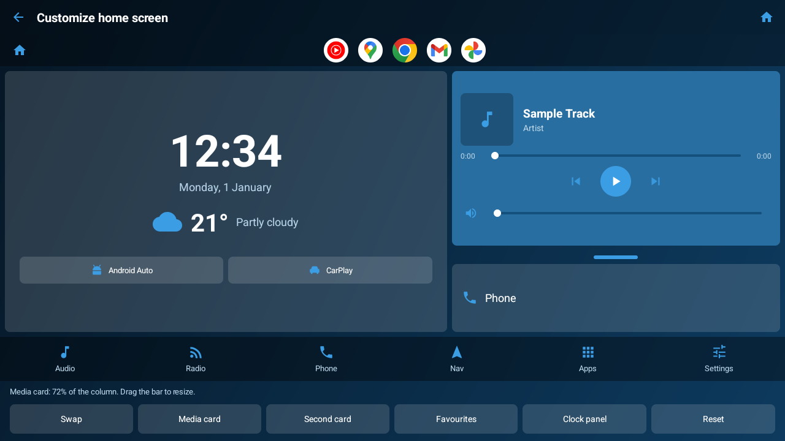
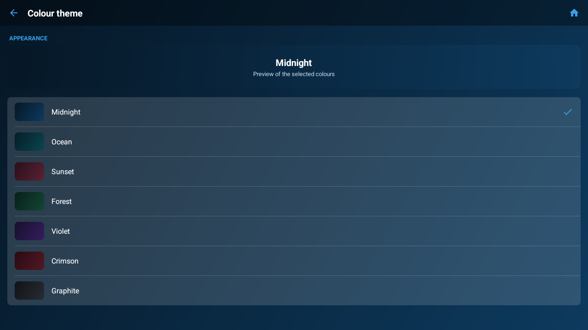
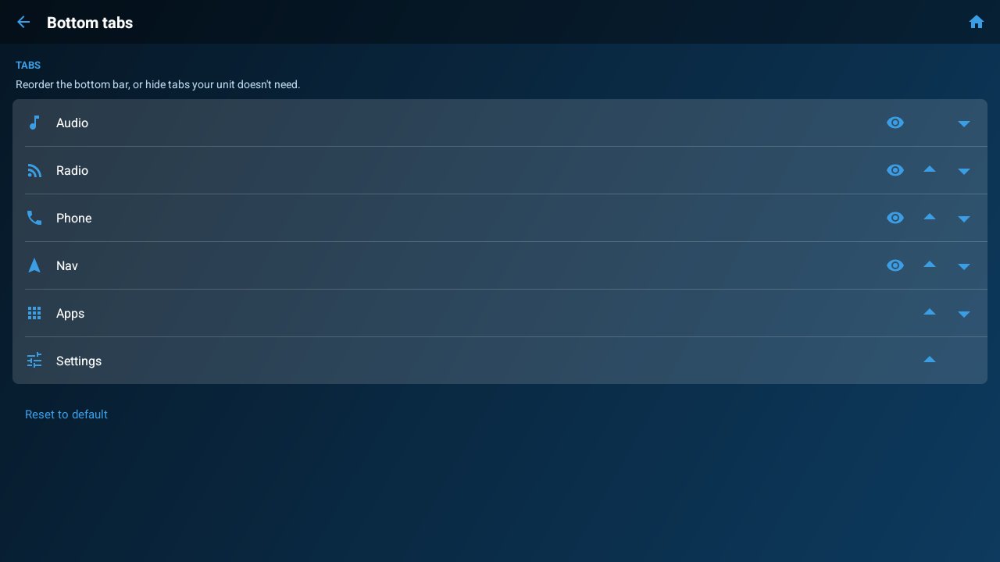

<p align="center">
  
</p>

<h1 align="center">Dashline</h1>

<p align="center">
  <a href="https://github.com/metehankaygsz/dashline/actions/workflows/build.yml"></a>
  <a href="LICENSE"></a>
  <a href="https://developer.android.com/about/versions/android-4.4"></a>
</p>

<p align="center">
  A clean, minimal Android home-screen launcher for car head units — the cheap<br>
  aftermarket "Android radio" double-DIN units, not Android Auto.
</p>

<p align="center">
  Kotlin, classic Views, landscape-first with a portrait layout for upright<br>
  screens, <b>no Google Play Services required</b>,<br>
  and it runs all the way back to <b>Android 4.4 (KitKat)</b> so it works on old units too.
</p>

---

## How it works

The whole launcher is one screen. A status bar across the top, two panels below
it, and a tab bar along the bottom.



**The top bar** holds a Home button, five quick-launch favourites, and a Wi-Fi
indicator that only appears when the unit is connected. Tap an empty favourite
slot to assign an app, long-press one to change or clear it.

**The left panel** is the clock and weather: a large clock and date, current
conditions, and a three-day forecast. The clock face can be digital, analog or
minimal, and an optional stopwatch sits under it.



**The right column is two cards, and both are yours to fill.** Either one can be:

- the **media player** — album art, title and artist read from whatever app is
  actually playing, with play/pause, skip, a scrubbable seek bar and volume;
- the **phone shortcut**;
- a row of **app shortcuts** you choose;
- up to three **Android home-screen widgets**, hosted for real — the same
  widgets you'd put on a phone's home screen.



**The bottom tabs** are Audio, Radio, Phone, Nav, Apps and Settings, each mapped
to an app you pick. They can be reordered, and any of them except Apps and
Settings can be hidden — those two stay because they're the only way back into
the launcher's own screens.

### Laying it out

**Settings → Customize home screen** is a live editor: it inflates the real
dashboard, so what you're dragging is exactly what you'll get. Drag the bar
between the cards to resize them, swap their order, and choose what each one
holds.



| Colour themes | Tab editor |
|---|---|
|  |  |

### On upright screens

Portrait units stack the panels and fill the space underneath with the app
drawer. It doesn't scroll: it measures the room it has, works out how many rows
fit, and pages the rest — swipe across the icons or tap a dot to change page.
Reaching for a scrollbar while driving is worse than a swipe.

---

## Features

**Dashboard**

- Large clock and date, current weather, and a 3-day forecast
- Digital, analog or minimal clock face, plus an optional stopwatch
- Live media panel: album art, title/artist, play-pause, next/previous, volume,
  and a scrubbable seek bar with elapsed/total times
- Controls drop out in order as a card shrinks, rather than being squashed
- Two configurable cards: media player, phone, app shortcuts, or app widgets
- Quick-launch dock of 5 favourite apps in the top bar
- Wi-Fi indicator (only shown when connected)
- Six tabs: **Audio · Radio · Phone · Nav · Apps · Settings**

**App widgets**

- Any installed home-screen widget can be hosted on either card, up to three
  side by side
- Add, swap and remove them from the Customize screen, or by long-pressing the
  card itself
- Widgets that need a configuration step get one, and are told their real size
  so they pick the right layout

**App drawer**

- Live search
- "Frequently used" strip based on your own launch history
- Long-press any app to hide it from the drawer
- Refreshes automatically when apps are installed or removed
- On portrait units, a paged drawer sits on the home screen itself

**Appearance**

- **7 colour schemes** — Midnight, Ocean, Sunset, Forest, Violet, Crimson,
  Graphite — each applying a gradient and matching accent across the whole UI,
  icons included
- Light and dark palettes; dark by default, with Auto (by time of day), Light,
  and Follow-system options
- Runs fullscreen with the system bars hidden, using its own in-app Back/Home
  navigation on every screen

**Staying up to date**

- The sideloaded build checks GitHub Releases for a newer version, at most once
  a day, and offers it with its release notes — *Update now*, *Later*, or *Skip
  this version*. Skipping is remembered per version, so it never hides a later
  one
- It downloads the APK and hands it to the system installer, so there's no
  hunting for a browser on a unit that may not have one
- **Settings → About** shows the version and build number, and checks on demand:
  it answers either way, rather than leaving "no prompt" to mean both *you're
  current* and *the check never ran*
- Only in the sideloaded build. The Play version updates through Play, and the
  two are signed with different keys, so neither could install the other

**Setup and settings**

- Guided first-run setup: language, default apps, permissions, and a prompt to
  become the default launcher
- Everything re-configurable later in Settings
- **10 languages**: English, Turkish, Spanish, German, French, Italian,
  Portuguese, Russian, Simplified Chinese, Arabic (with RTL support)

---

## Requirements

| | |
|---|---|
| Min Android | 4.4 KitKat (API 19) sideloaded · 5.0 (API 21) via Play |
| Target Android | 16 (API 36) |
| Orientation | Landscape and portrait |
| Google Play Services | Not required |
| API keys | None |

Designed for common head-unit resolutions — 1024×600 and 800×480 both work,
and upright screens get their own stacked layout.

---

## Install

Grab the APK from the [latest release](../../releases/latest) and sideload it:

```bash
adb install -r dashline-v0.1.4.apk
```

Or copy the APK to a USB stick, plug it into the head unit, and open it with the
unit's file manager.

After that first install, the app offers its own updates: it checks GitHub once
a day and can download and install a new release for itself. Android asks you to
allow it to install packages the first time.

## Build from source

Open the project in **Android Studio** (Giraffe or newer). It will fetch the
right Gradle and SDK versions and generate the Gradle wrapper on first sync.

Then, from the command line:

```bash
./gradlew assembleDebug
```

```bash
./gradlew installDebug
```

### Build flavours

Google Play's installer refuses anything below API 21, but many cheap head units
still run Android 4.4. The project therefore ships two flavours of the same app:

| Flavour | minSdk | Where it goes |
|---|---|---|
| `legacy` | 19 | The sideloadable APK on GitHub Releases — works on KitKat |
| `play` | 21 | The App Bundle uploaded to the Play Store |

```bash
./gradlew assembleLegacyRelease   # APK for sideloading
./gradlew bundlePlayRelease       # AAB for the Play Console
```

Both share the same `applicationId`, so any given device only ever sees one of
them as "the app".

### Building a release

Release builds are minified with R8 and must be signed. Create a key once —
choose your own passwords when prompted:

```bash
keytool -genkey -v -keystore release.jks -alias release -keyalg RSA -keysize 2048 -validity 10000
```

Copy `keystore.properties.example` to `keystore.properties` and fill in your
values, then:

```bash
./gradlew assembleRelease
```

`keystore.properties` and `*.jks` are gitignored — **never commit them**. Losing
the key means you can't publish updates that upgrade an existing install, so back
it up somewhere safe.

### Publishing a release

Tagging a version builds and publishes a signed APK automatically:

```bash
git tag v0.1.4 && git push origin v0.1.4
```

This needs four repository secrets under **Settings → Secrets and variables →
Actions**: `KEYSTORE_BASE64` (`base64 -i release.jks`), `KEYSTORE_PASSWORD`,
`KEY_ALIAS` and `KEY_PASSWORD`.

### Setting it as the launcher

After installing, press the unit's Home button and choose this launcher, then
select "Always". To reset the default while developing:

```bash
adb shell cmd package set-home-activity com.dashline.launcher/.HomeActivity
```

---

## Permissions

All optional — the launcher degrades gracefully without them.

| Permission | Used for | Without it |
|---|---|---|
| Location | Local weather | Weather panel hides, clock still works |
| Notification access | Reading now-playing media | Media widget becomes a launch button |
| Query all packages | Listing installed apps | Required for the app drawer |

Notification access can't be granted by a normal permission dialog — Android
requires the user to enable it in system settings. Setup links straight there,
and you can revisit it at **Settings → Media info access**.

---

## Weather

Weather comes from [Open-Meteo](https://open-meteo.com), which is free and needs
**no API key or account**. Location is read through the platform
`LocationManager`, so no Play Services dependency. It refreshes every 15 minutes,
and you can switch between °C and °F in Settings.

---

## Project layout

```
app/src/main/
├── AndroidManifest.xml              # HOME intent-filter, notification listener
├── java/com/dashline/launcher/
│   ├── App.kt                       # applies saved language + theme at startup
│   ├── BaseActivity.kt              # locale, fullscreen, gradient, icon tint, nav
│   ├── HomeActivity.kt              # the dashboard
│   ├── CustomizeActivity.kt         # live layout editor
│   ├── WidgetHost.kt                # binds and renders app widgets
│   ├── SwipeLinearLayout.kt         # page-turning container for the drawer
│   ├── AnalogClockView.kt           # the analog face
│   ├── AppDrawerActivity.kt         # app grid: search, frequent, hide
│   ├── AppPickerActivity.kt         # "choose an app for this role"
│   ├── AppAdapter.kt                # app grid cells
│   ├── SetupActivity.kt             # first-run onboarding
│   ├── SettingsActivity.kt          # settings
│   ├── TabAction.kt                 # the six tabs and what they launch
│   ├── TabOrderActivity.kt          # reorder / hide tabs
│   ├── GradientPickerActivity.kt    # colour scheme picker
│   ├── GradientThemes.kt            # the 7 colour schemes
│   ├── ThemeManager.kt              # light / dark / auto
│   ├── LocaleManager.kt             # in-app language override
│   ├── MediaMonitor.kt              # reads the active MediaSession
│   ├── WeatherRepository.kt         # Open-Meteo client
│   ├── AppRepository.kt             # query + launch installed apps
│   ├── DefaultLauncher.kt           # "make this the home app" helper
│   ├── Prefs.kt                     # all persisted settings
│   ├── Permissions.kt               # runtime permission helpers
│   └── Usage.kt                     # launch-count tracking
└── res/
    ├── layout/                      # landscape dashboard and all other screens
    ├── layout-port/                 # portrait dashboard (same ids as landscape)
    ├── values/                      # strings, light palette, styles
    ├── values-night/                # dark palette
    ├── values-h600dp/               # roomier sizes on taller screens
    ├── values-v21/                  # API 21+ theme attributes
    └── values-{ar,de,es,fr,it,pt,ru,tr,zh}/   # translations
```

---

## Compatibility notes

Supporting old head units shapes a few decisions worth knowing before you change
things:

- **Dependencies are pinned** to the last KitKat-compatible releases
  (appcompat 1.4.2, core-ktx 1.9.0, recyclerview 1.2.1). Bumping to appcompat
  1.6+ or core-ktx 1.10+ raises `minSdk` to 21 and breaks the build.
- **Launcher icons ship as PNG mipmaps**, because vector and adaptive icons don't
  render as app icons before Android 5.0. Adaptive icons in `mipmap-anydpi-v26`
  are used only on API 26+.
- **API 21+ theme attributes** live in `values-v21/` so they don't affect KitKat.
- **Fullscreen** goes through `WindowInsetsControllerCompat` rather than the
  raw `systemUiVisibility` flags: from targetSdk 35 Android enforces
  edge-to-edge and those flags stop behaving predictably. The compat layer
  maps to them on old devices, so KitKat still works.
- **The language override** wraps each activity's context instead of using
  `AppCompatDelegate.setApplicationLocales`, which needs appcompat 1.6+.
- **The media panel requires Android 5.0+** (`MediaSessionManager`). On KitKat it
  falls back to acting as a launch button.
- **Widgets are bound through `ACTION_APPWIDGET_BIND`**, not the system's
  widget picker: that picker binds on the caller's behalf, which needs the
  signature-level `BIND_APPWIDGET` permission no normal app can hold.

---

## Contributing

Screenshots in this README are captured from a real unit. To refresh them after a
UI change, connect the head unit (or an emulator) with USB debugging on and run:

```bash
./tools/capture-screenshots.sh
```

Read the **Compatibility notes** above before upgrading any dependency — several
are pinned deliberately to keep Android 4.4 support.

---

## Roadmap

- Reorderable favourites dock (drag and drop)
- Hourly forecast in the weather panel
- Quick-dial contacts on the phone card

---

## License

MIT — see [LICENSE](LICENSE).
